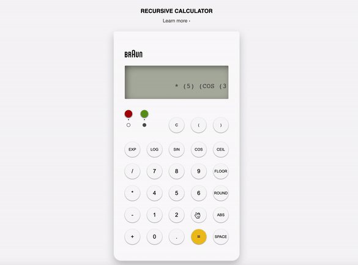

# Recursive Calculator



This calculator can perform calculations on unary and binary expressions written in Polish notation (operator is prefixed to operands). It can use either a recursion algorithm, or a single-pass algorithm to solve complex expressions where an operand is another expression.

## Implementation Details

This project was divided into three main tasks: the creation of the calculation engine, the development of a memory manager for saving values, and the formation of the interface controllers.

### Calculation Engine

The calculation engine is the component that is responsible for evaluating a string math expression.

After establishing clear definitions for each element of a math expression, it was possible to understand the problem at hand in a reasoned way. Essentially, the polish notated expressions start either with an unary operator or a binary operator. The unary operator takes one operand; the binary operator takes two operands. On complex expressions, the operand is itself, another unary or binary expression.

| Unary Operators          | Binary Operators     |
| ------------------------ | -------------------- |
| `sin` : Sine             | `+` : Addition       |
| `cos` : Cosine           | `-` : Subtraction    |
| `exp` : Euler’s number   | `*` : Multiplication |
| `log` : Logarithm base e | `/` : Division       |
| `round` : Rounding       |                      |
| `ceil` : Rounding up     |                      |
| `floor` : Rounding down  |                      |

Since the main goal for this project is to learn programming, the development of the algorithm explored two approaches: a multiple-pass parser and evaluator using recursion, and a single pass evaluator using a FILO (first in, last out) stack. These algorithms explore both functional programming and object-oriented programming on a test-driven development base, using [Jest](https://jestjs.io/).

The multiple-pass algorithm has a parser and an evaluator. The parser’s objective is to take the validated expression input and transform it into a high level output that is easily managed for evaluation. It can output the expression as a multi-level array or as a modelled class instance. The evaluator, either class modelled or funcional, takes the correspondent input format and will evaluate the expression, using recursion on complex expressions.

The single-pass algorithm has a simpler approach, but harder to test. By reversing the Polish notation (the operators follow their operands), the parsing of the validated expression becomes less complex because there is no need for parenthesis nor special care for the order of precedence. It resorts to a FILO stack, that pushes operands until there is an operator. If the operator is unary, it pops one operand from the stack; if the operator is binary it pops two operands from the stack. Then the calculation is made and pushed to the stack until the final result can be returned.

### Memory Manager

The Memory Manager follows a CRUD (create, read, update, delete) pattern for managing two memories for the calculator.

When the class is created, there are no memories. For them to be created, they require an inherent name identifier. Only after then, we can assign a value to a memory, using the _update_ method. It is important to note that the class does not overwrite memories with same identifier. With the method _loadMemory_, an expression that has memory names can be replaced by an expression that has the correspondent values.

### Commands Manager

In order to have interaction between the calculation and memory processing of the calculator, there is a class called _Commands Manager_. It connects the two modules by accepting both of them as arguments. Each main functionality has an abstracted command name, in a format of initials, by which the user is able to execute them.

| List of Commands |                                        |
| ---------------- | -------------------------------------- |
| `VM`             | Read memory value                      |
| `LM`             | List all memories                      |
| `CE`             | Calculate the value of an expression   |
| `AVM`            | Assign last calculated value to memory |
| `A`              | Help                                   |
| `AM`             | Create memory                          |
| `S`              | Exit                                   |

### Interface Controllers

The interface controllers respond to the user inputs, interacting with the calculator’s functionalities and rendering the data back to the interface.

When the user clicks on one of the interface’s keys, the _Numpad Controller_ receives the input and determines the value to pass on to the _Main Controller_. The _Main Controller_, receives that value, interacts with the _Commands Manager_, which then passes the value to the _Display Controller_, to be displayed on the interface.

## Usage

Import the `CommandsManager`, `MemoryManager`, `DisplayController`, `NumpadController`, and `MainController` classes from `src` directory.

Next choose one of the developed methods for the calculation engine. In this example I'll use the single-pass stack -> import the function `singlePassEvaluator`.

Create a new instance of the _MemoryManager_, and the _CommandsManager_. Use the _MemoryManager_ and the _singlePassEvaluator_ function as arguments for the _CommandsManager_.

```js
const memoryManager = new MemoryManager();
const calcEngine = singlePassEvaluator;
const calculator = new CommandsManager(memoryManager, calcEngine);
```

Create a new instance of the _DisplayController_, with an object that as the display's elements as values of the inherent properties.

```js
const mainDisplay = document.querySelector(".display__main");
const secondaryDisplay = document.querySelector(".display__secondary");

const displayController = new DisplayController({
  elMain: mainDisplay,
  elSecondary: secondaryDisplay,
});
```

The instance for the _NumpadController_, must have an object with the defined key element's name ID, as the first argument. The second argument is a callback to the _MainController's_ _addToDisplay_ method.

```js
const numpad = {
  expID: "exp",
  logID: "log",
  sinID: "sin",
  cosID: "cos",
  ceilID: "ceil",
  floorID: "floor",
  roundID: "round",
  absID: "abs",
  addID: "add",
  subtractID: "subtract",
  divideID: "divide",
  multiplyID: "multiply",
  oneID: "one",
  twoID: "two",
  threeID: "three",
  fourID: "four",
  fiveID: "five",
  sixID: "six",
  sevenID: "seven",
  eightID: "eight",
  nineID: "nine",
  zeroID: "zero",
  clearAllID: "clearAll",
  openID: "open",
  closeID: "close",
  exitID: "exit",
  helpID: "help",
  dotID: "dot",
  equalID: "equal",
  spaceID: "space",
};

const numpadController = new NumpadController(numpad, (value) =>
  mainController.addToDisplay(value)
);
```

To conclude, create new instance of the _MainController_, with an object as argument, containing the _DisplayController_, the _NumPadController_, the _calculator_, (_CommandsMananger_).

```js
const mainController = new MainController({
  displayController: displayController,
  numpadController: numpadController,
  calculator: calculator,
});
```

> **! Notes**
>
> the memory capacities of the calculator are not present in this interface.
>
> I did not include a production bundle because it was not part of my focus for this project.

## Development

To install the component, clone repository, change into directory on the terminal and install with npm.

```http
git clone https://github.com/kevinsilva/recursive-calculator.git
cd recursive
npm install
```

Add this to `package.json` scripts property.

```js
"scripts": {
  "test": "jest --env=jsdom"
},
"babel": {
  "env": {
    "test": {
      "plugins": [
        "@babel/plugin-transform-modules-commonjs"
      ]
    }
  }
},
```

To run the tests.

```http
  npm test <file>
```

## Credits

Big thanks to my mentor 🎓, [William R. J. Ribeiro](https://github.com/williamrjribeiro/), and to my teammate, André Christofori.

Interface based on [Braun](https://us.braun.com/en-us/) ET66, designed by Dieter Rams.

## License

[MIT](https://choosealicense.com/licenses/mit/)
